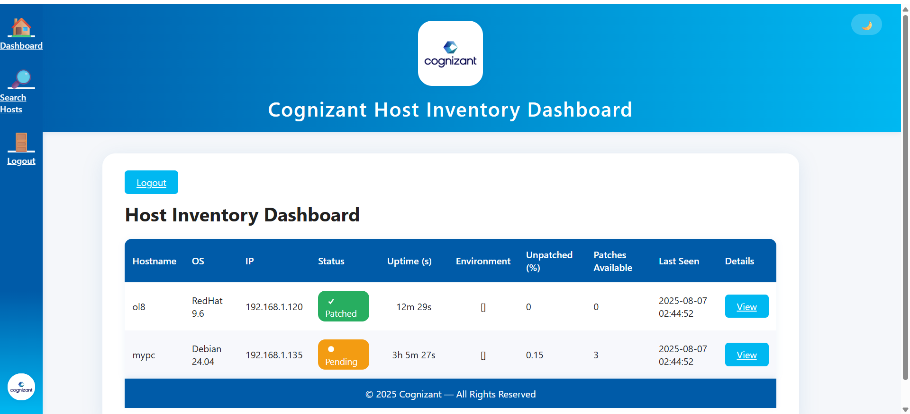
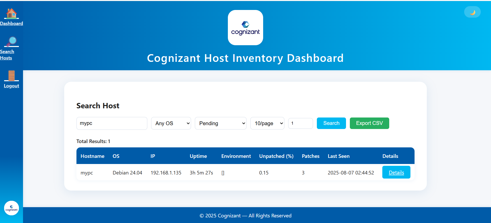
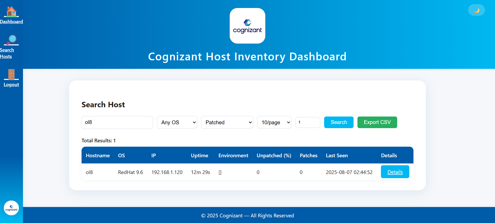

# Cognizant Host Inventory Dashboard

A modern, secure, and user-friendly dashboard for Linux patch management and host inventory, integrating Ansible automation, PHP/MySQL backend, and a Cognizant-branded responsive UI.

---

## Features
- **Dashboard**: View all managed hosts, patch status, OS, uptime, environment, and more.
- **Host Details**: Drill down to see upgradable packages and host metadata.
- **Search**: Fuzzy/partial search by hostname, IP, environment, OS, or patch status, with pagination and CSV export.
- **Branding & UX**: Cognizant-themed, dark mode, sidebar navigation, badges, animations, and mobile responsive.
- **Security**:
  - Login with hashed passwords (bcrypt)
  - Session-based authentication for all main pages
  - API key-protected ingestion for Ansible playbook data
  - SQL injection prevention and input sanitization
- **Ansible Integration**: Playbooks for inventory gathering and patching, with reboot and post-patch reporting.
- **Extensible**: Easy to add hosts, OS types, and custom fields.

---

## Screenshots
Screenshots are available in the `doc/` folder:
- Dashboard: 
- Host Details: 
- Search: 

---

## Security Highlights
- **API Key for Playbook Ingestion**: Only authorized Ansible playbooks can update inventory/patch data.
- **Password Hashing**: Uses PHP's `password_hash()`/`password_verify()` for secure user authentication.
- **Session Management**: All pages require login; session-based checks prevent unauthorized access.
- **Input Sanitization**: All DB inputs are sanitized to prevent SQL injection.

---

## Setup Instructions
1. Clone the repo and import `db_schema.sql` into MySQL.
2. Update `api/config/config.php` with your DB credentials and a secure API key.
3. Create users with hashed passwords (see below).
4. Configure your Ansible hosts and use provided playbooks for data ingestion.
5. Access the dashboard at `/api/login.php` and log in.

### Creating a User
Generate a hash in PHP:
```php
php -r "echo password_hash('yourpassword', PASSWORD_DEFAULT);"
```
Insert into DB:
```sql
INSERT INTO users (username, password_hash) VALUES ('youruser', 'generated_hash');
```

---

## Folder Structure
- `api/` - PHP backend and UI
- `api/css/` - Stylesheets
- `api/config/` - Central config
- `api/images/` - Logo and images
- `doc/` - Documentation and screenshots
- `gather_inventory.yml`, `patch_and_report.yml` - Ansible playbooks
- `db_schema.sql` - MySQL schema

---

## License
(C) 2025 Cognizant. All Rights Reserved. For internal use only.
